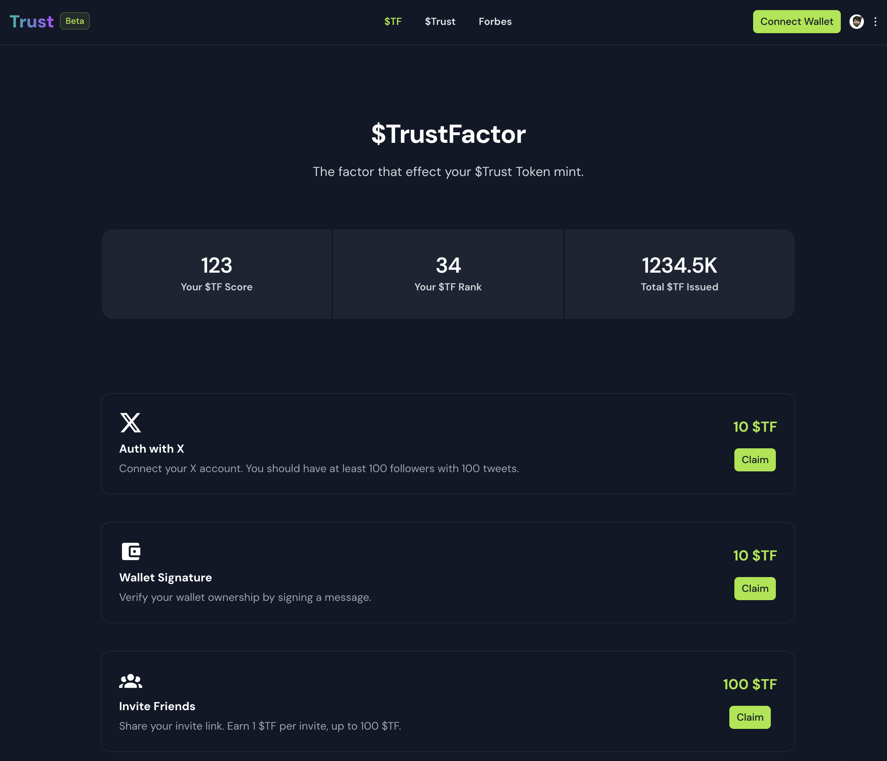
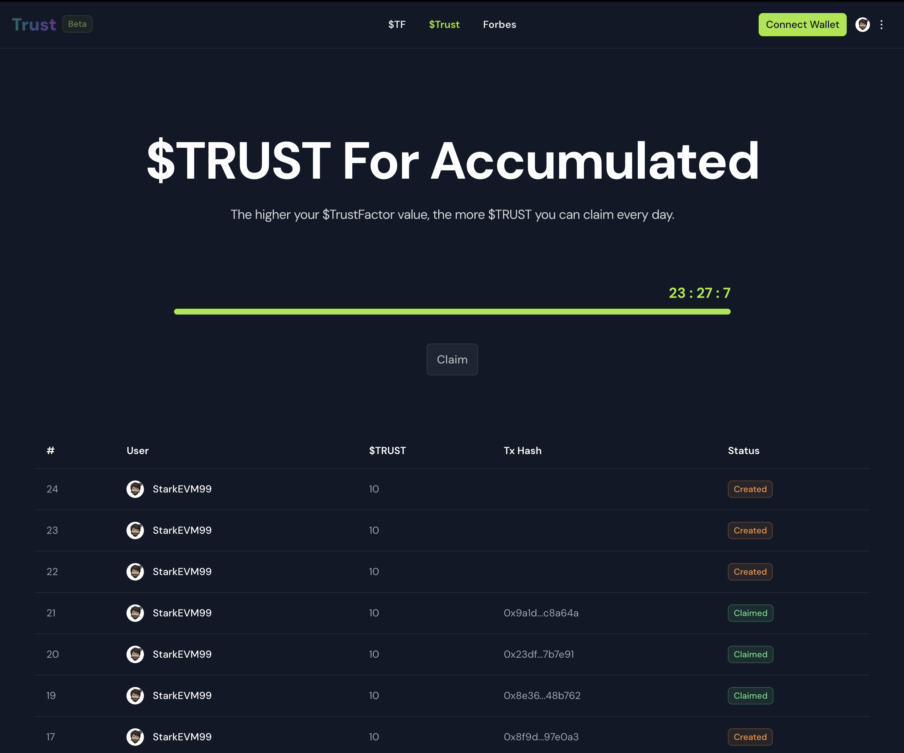
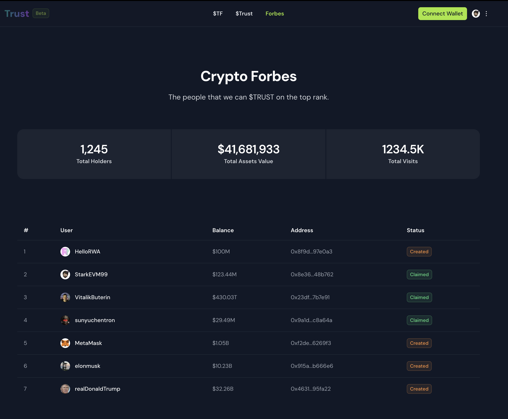

# Trust.RWA-Wallet.com

- [PPT](./trust.key)
- [contracts](./contracts)

## 起源

前几周就在想做一个持币富豪榜，根据用户持有数字资产、 X 活跃度、其他认证用户的评分评论以及未来想到的其他因子来综合评估一个用户的 `$TrustFactor` 值。

这个分数则代表了该用户每天可以挖的 `$Trust` 代币数量。

用户绑定 X，然后关联钱包地址（或者其他方式来验证某个钱包地址是该 X 用户持有的），然后统计每个地址的余额，做一个列表。

## Bethink Hackeathon

正好这次黑客松驱动开发，根据命题三，来开发了这款产品的 MVP。

`Human Verification - 人类验证`

"如何证明你是真实的人类？"

“人类验证” 检验多种验证方法，包括：

- 生物特征识别技术，如面部识别、指纹扫描、虹膜扫描和语音识别。
- 行为特征验证方法，如键盘输入习惯和鼠标移动轨迹。
- 游戏化验证技术，使验证过程更具吸引力，如图像识别游戏和拼图游戏。
- 人工智能和机器学习应用，通过历史行为数据进行个性化和动态验证。
- 多因素和多层次验证，以提高安全性和可靠性。
- 隐私和数据保护考虑，包括匿名验证和数据加密传输。

根据命题，可以有以下一些验证记分方式：

- 用户 X 登录 `10 $TF`
- 用户分享其邀请链接，可以邀请其他用户加入，根据邀请人数来增加其 `$TrustFactor` 值, 每个邀请增加 `1 $TF`，封顶 `100  $TF`
  - 注意这里可能需要引入防垃圾数据算法，比如引入的用户后面发现是垃圾账号，则会倒扣分值
- 钱包签名验证：`10 $TF`
- 打款验证地址: `10 $TF`，给用户一个随机的小额资金数量，用户打款到指定地址，即可认为验证通过
- 付费购买 $TF, `10 $BSTSwap = 1 $TF`
- 分享持币富豪榜，`10 $TF`
- 持币总资产超过 10000 USDC, 并且榜单在前 100 名，`50 $TF`
- 浏览器 passkey 验证 `10 $TF`
- 提交声纹 `10 $TF`







## 合约实现

### [TrustFactory](./contracts/TrustFactory.sol)

通过服务器端提供签名信息，用户会获得对应的 `$TrustFactor` 代币。

```solidity
function mint(address to, uint256 amount, string memory nonce, bytes memory signature) public whenNotPaused {
    bytes32 messageHash = MessageHashUtils.toEthSignedMessageHash(
        keccak256(abi.encodePacked(msg.sender, amount, nonce))
    );
    address _signer = ECDSA.recover(messageHash, signature);
    require(_signer == signer, "Invalid signature");
    _mint(to, amount);
}
```

### [Trust](./contracts/Trust.sol)

用户每 24 小时可以领取一次 `$Trust` 代币，领取的数额和用户的 `$TrustFactor` 成正比。
未来可能会增加更多改进性算法。

```solidity
function claim(address to) public whenNotPaused {
    require(block.timestamp >= lastClaimTime[to] + 24 hours, "Can only claim once every 24 hours");

    uint256 tfScore = IERC20(tfAddress).balanceOf(address(to));
    uint256 tfTotalSupply = IERC20(tfAddress).totalSupply();
    uint256 amount = (tfScore * dailySupply) / tfTotalSupply;
    _mint(to, amount);

    lastClaimTime[to] = block.timestamp;
}
```


## 未来规划

- 持续研究更多验证方式，增加验证因子
- 和各种项目方合作，更多形式地验证用户身份
- 开发更多使用场景，比如游戏内支付、打折卡、空投活动等
- 开发更多玩法，激励用户良性活跃，良性挖矿
